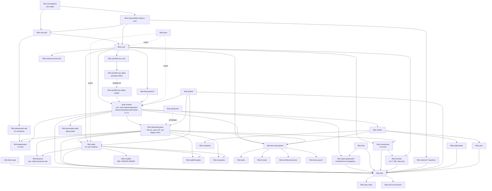

<!-- Local working notes for Claude. Not for upstream contribution.
     This file is RAT-excluded (see flink-examples/flink-examples-streaming/pom.xml
     and the root pom.xml's apache-rat-plugin <excludes>). -->

# Apache Flink — working notes for Claude

This is a local fork of Apache Flink 2.x (currently `2.3-SNAPSHOT`). Each top-level Maven module has its own `CLAUDE.md` with architecture, key classes, dependencies, and pitfalls. This file is the index, the build cheat-sheet, and the cross-module dependency map.

---

## Where to look first

- **Module-specific notes**: `<module>/CLAUDE.md` (see the table in the [Module index](#module-index) below).
- **Deep-dive docs** (architecture / algorithm explanations across modules): `codedocs/*.md`. RAT-excluded; these are richer working docs.
- **Tutorial code examples** with comparison commentary: `flink-examples/flink-examples-streaming/src/main/java/org/apache/flink/streaming/examples/TwoPhaseCountDeduplicatedEventTime{V2,V3,V4,V5}.java`.

---

## MCP Tools: code-review-graph

**IMPORTANT: This project has a knowledge graph. ALWAYS use the
code-review-graph MCP tools BEFORE using Grep/Glob/Read to explore
the codebase.** The graph is faster, cheaper (fewer tokens), and gives
you structural context (callers, dependents, test coverage) that file
scanning cannot.

### When to use graph tools FIRST

- **Exploring code**: `semantic_search_nodes` or `query_graph` instead of Grep
- **Understanding impact**: `get_impact_radius` instead of manually tracing imports
- **Code review**: `detect_changes` + `get_review_context` instead of reading entire files
- **Finding relationships**: `query_graph` with callers_of/callees_of/imports_of/tests_for
- **Architecture questions**: `get_architecture_overview` + `list_communities`

Fall back to Grep/Glob/Read **only** when the graph doesn't cover what you need.

### Key Tools

| Tool | Use when |
| ------ | ---------- |
| `detect_changes` | Reviewing code changes — gives risk-scored analysis |
| `get_review_context` | Need source snippets for review — token-efficient |
| `get_impact_radius` | Understanding blast radius of a change |
| `get_affected_flows` | Finding which execution paths are impacted |
| `query_graph` | Tracing callers, callees, imports, tests, dependencies |
| `semantic_search_nodes` | Finding functions/classes by name or keyword |
| `get_architecture_overview` | Understanding high-level codebase structure |
| `refactor_tool` | Planning renames, finding dead code |

### Workflow

1. The graph auto-updates on file changes (via hooks).
2. Use `detect_changes` for code review.
3. Use `get_affected_flows` to understand impact.
4. Use `query_graph` pattern="tests_for" to check coverage.

---

## Building

This repo ships a Maven Wrapper — always invoke via `./mvnw` (not a system `mvn`).

### Cheat sheet

```bash
# Full build, fast (skip RAT/checkstyle/spotless/javadoc/japicmp/cyclonedx, no tests)
./mvnw clean package -DskipTests -Dfast -T 1C

# Fastest possible iteration on a single module (offline, build deps automatically)
./mvnw -pl flink-examples/flink-examples-streaming -o package -DskipTests -Dfast -T 1C -am

# Resume a failed full build
./mvnw clean package -DskipTests -Dfast -T 1C -rf :flink-runtime

# Run one specific test
./mvnw -pl flink-examples/flink-examples-streaming -o test \
    -Dtest=TwoPhaseCountDeduplicatedEventTimeV5Test -Dfast

# Skip just tests' compilation (when you're sure tests are fine)
./mvnw -DskipTests -Dmaven.test.skip=true -Dfast clean package -T 1C
```

### Useful flags

| Flag | What it does |
|---|---|
| `-DskipTests` | Skip running tests (still compiles them) |
| `-Dmaven.test.skip=true` | Also skip compiling tests |
| `-Dfast` | Activates `fast` profile in root pom — skips RAT, checkstyle, spotless, javadoc, japicmp, cyclonedx, enforcer. Defined in `pom.xml:1270-1330`. |
| `-Dcheckstyle.skip=true` | Skip checkstyle individually |
| `-Dspotless.check.skip=true` | Skip spotless individually |
| `-Drat.skip=true` | Skip Apache RAT individually |
| `-T 1C` | Parallel build, 1 thread per core (typically ~2-3× faster) |
| `-o` | Offline (after first online build populated `~/.m2/`) |
| `-pl <module>` | Build only this module |
| `-am` | "Also-make" — build the requested module's dependencies |
| `-rf :<module>` | Resume from this module (after a failed build) |

### IntelliJ setup gotchas

This fork has been tuned for local IntelliJ work. Three settings matter:

1. **Delegate IDE build/run actions to Maven**: Settings → Build, Execution, Deployment → Build Tools → Maven → Runner → check the "Delegate IDE build/run actions to Maven" box. This makes IntelliJ honor `${flink.surefire.baseArgLine}` and avoid Java 17+ module access errors.
2. **Maven runner properties** (Settings → … → Maven → Runner → Properties): add `checkstyle.skip = true`, `spotless.check.skip = true`, `rat.skip = true` if you want IntelliJ to skip the slow checks too.
3. **JDK 17+ JVM args** (if IntelliJ ever runs tests through its own JUnit runner instead of Maven): paste into the JUnit run-config template's VM options:
   ```
   --add-exports=java.management/sun.management=ALL-UNNAMED
   --add-exports=java.rmi/sun.rmi.registry=ALL-UNNAMED
   --add-exports=java.security.jgss/sun.security.krb5=ALL-UNNAMED
   --add-opens=java.base/java.util=ALL-UNNAMED
   --add-opens=java.base/java.lang=ALL-UNNAMED
   --add-opens=java.base/java.net=ALL-UNNAMED
   --add-opens=java.base/java.io=ALL-UNNAMED
   --add-opens=java.base/java.util.concurrent=ALL-UNNAMED
   ```

### Build-time output landmarks

- `flink-dist/target/flink-2.3-SNAPSHOT-bin/flink-2.3-SNAPSHOT/` — the produced distribution tarball layout (`bin/`, `lib/`, `opt/`, `plugins/`, `conf/`, `examples/`).
- `flink-runtime/src/test/.../*TestHarness*.java` — operator test harnesses available via `flink-runtime`'s test-jar.
- `target/rat.txt` — RAT report when license check fails.

---

## Module index

40 top-level modules in the root `pom.xml`. Each has a `CLAUDE.md` with architecture, key classes, dependencies, pitfalls.

| Module | One-liner | CLAUDE.md |
|---|---|---|
| `flink-annotations` | API-stability annotations (`@Public` / `@PublicEvolving` / `@Experimental` / `@Internal`) + `@Documentation.*` family; zero-deps root of the dep graph | [↗](flink-annotations/CLAUDE.md) |
| `flink-architecture-tests` | ArchUnit-based architectural rules (FreezingArchRule) enforcing the surface defined in flink-annotations over flink-core-api | [↗](flink-architecture-tests/CLAUDE.md) |
| `flink-core-api` | Minimal user-facing API jar (Function, KeySelector, Tuples, state declarations, watermarks); consumed by `flink-core` and `flink-datastream-api` only | [↗](flink-core-api/CLAUDE.md) |
| `flink-core` | Type system, serialization, configuration, MemorySegment, IO views — required by ~60 modules; the universal dep | [↗](flink-core/CLAUDE.md) |
| `flink-filesystems` | Aggregator: 8 sub-modules wrapping S3/GCS/OSS/Azure/Hadoop via plugin classloader isolation | [↗](flink-filesystems/CLAUDE.md) |
| `flink-rpc` | Apache Pekko-based RPC framework (3 sub-modules; the `flink-rpc-akka` name is historical — actually Pekko 1.4.0) | [↗](flink-rpc/CLAUDE.md) |
| `flink-runtime` | **The engine**: JobManager, TaskManager, scheduler, checkpointing, network stack, state-backend SPI. **Also houses much of the classical DataStream API in 2.x — including legacy `SourceFunction`** | [↗](flink-runtime/CLAUDE.md) |
| `flink-runtime-web` | Web UI: Java backend (`WebSubmissionExtension`, `HistoryServer`) + Angular 20 / NG-ZORRO frontend; built via `frontend-maven-plugin` | [↗](flink-runtime-web/CLAUDE.md) |
| `flink-streaming-java` | Slimmed-down in 2.x: just async I/O, specialized window machinery, legacy sinks, Sink V2 helpers (~96 classes) | [↗](flink-streaming-java/CLAUDE.md) |
| `flink-connectors` | Aggregator: 6 in-tree connectors remain (base, file-sink-common, files, datagen, datagen-test, hadoop-compatibility); Kafka/Kinesis/Pulsar/MongoDB/Elasticsearch/JDBC/Cassandra/RabbitMQ/HBase have moved to separate repos | [↗](flink-connectors/CLAUDE.md) |
| `flink-formats` | Aggregator: 12 sub-modules (Avro/Parquet/ORC/CSV/JSON/Protobuf/SequenceFile/raw/compress + Avro-Confluent + ORC-NoHive + format-common) plus 7 SQL uber-jar variants | [↗](flink-formats/CLAUDE.md) |
| `flink-examples` | Example programs: streaming, table, build-helper; this is where `TwoPhaseCountDeduplicatedEventTime{V2..V5}` and `SkewedAggregation` live | [↗](flink-examples/CLAUDE.md) |
| `flink-clients` | Job submission SPI (`CliFrontend`, `ClusterClient`, `PipelineExecutorFactory`, `ApplicationClusterEntryPoint`) — the seam every deployment backend plugs into | [↗](flink-clients/CLAUDE.md) |
| `flink-container` | Standalone-container JobManager entrypoint baked into the official `apache/flink` Docker image's `standalone-job` mode | [↗](flink-container/CLAUDE.md) |
| `flink-queryable-state` | **Deprecated since 1.18.** Two-tier Netty proxy/server for external clients querying operator state | [↗](flink-queryable-state/CLAUDE.md) |
| `flink-tests` | Big in-JVM ITCase suite (cross-module integration tests against an embedded MiniCluster); dominates CI time | [↗](flink-tests/CLAUDE.md) |
| `flink-end-to-end-tests` | 30+ sub-modules of real-cluster tests submitting jobs to a built `flink-dist` via CLI/REST/K8s/YARN; gated behind `run-end-to-end-tests` profile | [↗](flink-end-to-end-tests/CLAUDE.md) |
| `flink-test-utils-parent` | 7 sub-modules of shared test utilities: `flink-test-utils-junit` (loggers, latches), `flink-test-utils` (MiniCluster), `flink-connector-test-utils` (Dockerized), etc. | [↗](flink-test-utils-parent/CLAUDE.md) |
| `flink-state-backends` | Aggregator: 5 sub-modules — `flink-statebackend-rocksdb`, `flink-statebackend-forst`, `flink-statebackend-changelog`, `flink-statebackend-common`, `flink-statebackend-heap-spillable`. Default `HashMapStateBackend` lives in `flink-runtime` | [↗](flink-state-backends/CLAUDE.md) |
| `flink-dstl` | FLIP-158 Durable Short-term Log infrastructure for the changelog state backend (`flink-dstl-dfs` is the only sub-module) | [↗](flink-dstl/CLAUDE.md) |
| `flink-libraries` | Aggregator: just 2 sub-modules in 2.x — `flink-cep` (Complex Event Processing) and `flink-state-processing-api` (offline savepoint manipulation). Gelly removed. | [↗](flink-libraries/CLAUDE.md) |
| `flink-table` | The Table API / SQL stack: 21 sub-modules covering API (Java/Scala bridges), planner (Calcite), runtime, SQL client, SQL gateway, JDBC driver | [↗](flink-table/CLAUDE.md) |
| `flink-quickstart` | Maven archetype for new Flink projects. Only `flink-quickstart-java` remains in 2.x; the Scala archetype has been removed | [↗](flink-quickstart/CLAUDE.md) |
| `flink-dist` | The Flink distribution tarball: bundles uber-jar + scripts + conf + opt + plugins. The terminal assembly module. | [↗](flink-dist/CLAUDE.md) |
| `flink-dist-scala` | Sidecar bundling `scala-library` + `chill_2.12` + Scala-flavored planner pieces into one shaded jar that flink-dist copies into `lib/` | [↗](flink-dist-scala/CLAUDE.md) |
| `flink-metrics` | Aggregator: 10 reporter sub-modules (jmx, prometheus, datadog, graphite, influxdb, statsd, slf4j, otel, dropwizard, core); plugin-loaded via SPI | [↗](flink-metrics/CLAUDE.md) |
| `flink-yarn` | YARN deployment: ApplicationMaster, YarnClusterDescriptor, YarnResourceManagerDriver | [↗](flink-yarn/CLAUDE.md) |
| `flink-yarn-tests` | YARN integration tests (mini YARN cluster); **build-ordered after flink-dist** — needs the uber-jar | [↗](flink-yarn-tests/CLAUDE.md) |
| `flink-fs-tests` | Cross-cutting `FileSystem` / `DistributedCache` tests against a `MiniCluster` + `MiniDFSCluster` | [↗](flink-fs-tests/CLAUDE.md) |
| `flink-docs` | Documentation generator: scans configuration options + REST endpoints at build time, emits content for the `docs/` Hugo site | [↗](flink-docs/CLAUDE.md) |
| `flink-python` | PyFlink: Java side (Beam portability + PemJa embedded mode) + Python wheel; narrow Beam version pin coupling Java↔Python | [↗](flink-python/CLAUDE.md) |
| `flink-walkthroughs` | Guided tutorial archetypes (Fraud Detection DataStream, Spend Report Table API) | [↗](flink-walkthroughs/CLAUDE.md) |
| `flink-kubernetes` | Native K8s integration: KubernetesResourceManagerDriver, ConfigMap-based HA (FLIP-144), pod-template handling | [↗](flink-kubernetes/CLAUDE.md) |
| `flink-external-resources` | Pluggable external resource framework (currently only `flink-external-resource-gpu`); maps Flink resource names to YARN/K8s native resource names | [↗](flink-external-resources/CLAUDE.md) |
| `tools/ci/flink-ci-tools` | CI helper module: LicenseChecker, ShadeOptionalChecker, ScalaSuffixChecker — log-driven parsers, not classpath-driven | [↗](tools/ci/flink-ci-tools/CLAUDE.md) |
| `flink-datastream` | DataStream V2 impl (FLIP-409): `ExecutionEnvironmentImpl`, `*StreamImpl`, `*ProcessOperator` family. Runs alongside legacy DataStream. | [↗](flink-datastream/CLAUDE.md) |
| `flink-datastream-api` | DataStream V2 interface jar (FLIP-409). Depends only on `flink-core-api`. | [↗](flink-datastream-api/CLAUDE.md) |
| `flink-models` | **Not ML model serving via PyFlink.** SQL `CREATE MODEL` + `ML_PREDICT(...)` connectors — OpenAI HTTP + NVIDIA Triton KServe v2 | [↗](flink-models/CLAUDE.md) |
| `flink-tests-java17` | Tiny sibling of `flink-tests` for tests requiring JDK 17 source-level features (records) | [↗](flink-tests-java17/CLAUDE.md) |

---

## Module dependency graph

The dependency graph is too dense to render in full. Below are the **layers**: a module only depends on modules **above** it in the diagram. The arrows show the most important / load-bearing edges.



### ASCII fallback (in case Mermaid doesn't render)

```
              flink-annotations  (zero deps)
                 │
                 ▼
   flink-core-api ◄── flink-metrics/flink-metrics-core
                 │
                 ▼
              flink-core ──────► flink-filesystems/*
                 │
                 ▼
             flink-rpc/flink-rpc-core
                 │  (shaded into flink-rpc-akka-loader)
                 ▼
             flink-runtime  ◄── THE ENGINE; in 2.x, also houses
                 │            most StreamOperator / StreamTask
                 │            and the legacy SourceFunction.
       ┌─────────┼─────────┬──────────┬──────────┐
       ▼         ▼         ▼          ▼          ▼
   streaming   clients   state-     dstl     table  (21 sub-modules)
   -java                 backends/*
   (~96 cls)
       │         │
       │         ▼
       │   yarn / kubernetes / container       libraries  (cep, state-processor-api)
       │   (deployment SPI in flink-clients)   connectors (6 in-tree)
       │                                        formats   (12 + 7 SQL uber-jars)
       │
       ▼
   datastream-api → datastream  (DataStream V2; FLIP-409, runs alongside legacy)
       │
       ▼
   flink-dist  (bundles all of the above + flink-dist-scala into a tarball)
```

---

## Common pitfalls that bit during this work

These came up repeatedly while writing the per-module CLAUDE.md files. Reading this list saves time.

### 1. The legacy `SourceFunction` is in `flink-runtime`, not `flink-streaming-java`
Package: `org.apache.flink.streaming.api.functions.source.legacy.SourceFunction`. The package name suggests `flink-streaming-java` but the file actually lives under `flink-runtime/src/main/java/`. Example projects using legacy sources (V2/V3 of the deduplicated-count examples) need `flink-runtime` on the classpath. This is a **flink-2.x relocation** — historical examples assume the old layout.

### 2. Most of the classical DataStream API moved to `flink-runtime` in 2.x
`StreamExecutionEnvironment`, `DataStream`, `StreamOperator` / `AbstractStreamOperator` / `AbstractUdfStreamOperator`, `StreamTask`, the window assigners / triggers / `WindowOperator`, partitioners, stream-record carriers, and the legacy `SourceFunction` family — all in `flink-runtime`. `flink-streaming-java` now holds only ~96 production classes (mostly async I/O, specialized window machinery, legacy sinks, Sink V2 helpers).

### 3. Operator test harnesses come from `flink-runtime`'s test-jar
`OneInputStreamOperatorTestHarness`, `KeyedOneInputStreamOperatorTestHarness`, `ProcessFunctionTestHarnesses`, etc. Add `<dependency>` with `<type>test-jar</type>` and `<scope>test</scope>` to consume them.

### 4. RPC interfaces have a confusing package name
The interfaces (`RpcGateway`, `RpcEndpoint`, `RpcService`) sit in package `org.apache.flink.runtime.rpc` but the actual files live in `flink-rpc/flink-rpc-core`, not `flink-runtime`. Grep traps the unwary.

### 5. The "akka" name in `flink-rpc-akka` is historical
The Flink RPC layer migrated to Apache Pekko 1.4.0 (after Lightbend's Akka license change) but artifact / package names retained `akka` for git history. No actual Akka code remains. The `SubmoduleClassLoader` trick hides Pekko from the rest of the JVM.

### 6. `flink-table-planner-loader` is the only safe planner dep
The actual planner classes live under a `PlannerComponentClassLoader` for classloader isolation — connector/library code should depend on `flink-table-planner-loader`, not `flink-table-planner` directly.

### 7. JDK 17+ requires `--add-opens` / `--add-exports` for tests
The standard set is in `pom.xml:43-55,490-501`. IntelliJ doesn't pick these up unless you (a) delegate to Maven for test execution, or (b) paste them into the JUnit run-config template. See the [IntelliJ setup gotchas](#intellij-setup-gotchas) section.

### 8. `flink-quickstart-scala` is gone in 2.x
Only `flink-quickstart-java` remains. Scala support has been deprecated since 1.18 and the archetype was removed.

### 9. `flink-dist-scala` is *not* a Scala-API module
It's a tiny sidecar that shade-bundles `scala-library` + `scala-reflect` + `scala-compiler` + `chill_2.12` for runtime serialization needs. The Scala API itself is removed in 2.x; only Kryo-with-chill and the Scala-flavored Table planner (in `opt/`) remain.

### 10. `flink-models` is *not* ML model serving via PyFlink
It's the SQL `CREATE MODEL` + `ML_PREDICT(...)` connector framework — currently OpenAI HTTP + NVIDIA Triton KServe v2. Don't confuse with PyFlink's `flink-python`.

### 11. `flink-queryable-state` is deprecated since 1.18
The `@Deprecated` is on `QueryableStateClient` and `QueryableStateOptions`. Disabled by default (`queryable-state.enable = false`). Don't build new features on this.

### 12. `flink-yarn-tests` builds *after* `flink-dist`
Because the YARN E2E tests need the uber-jar. From a fresh checkout you must `./mvnw install -pl flink-dist -am` before running YARN tests. Unusual in the Flink module graph.

### 13. Default `HashMapStateBackend` is in `flink-runtime`, not `flink-state-backends`
The `flink-state-backends` aggregator only holds non-default backends (RocksDB, ForSt, changelog, common, heap-spillable). The default heap backend ships with `flink-runtime`.

### 14. `flink-state-processing-api` directory → `flink-state-processor-api` artifact
The directory name has "processing" but the produced artifact is `flink-state-processor-api` (no "ing"). Mind the `s`-vs-no-`s` when searching.

### 15. Don't mix DataStream V1 and DataStream V2
Two stacks coexist: legacy DataStream (`flink-streaming-java` + most of `flink-runtime`) and DataStream V2 (`flink-datastream-api` + `flink-datastream`). They share the lower-level `Transformation` / `StreamGraph` / `StreamOperator` runtime, but the user-level types are different and a single job's DAG cannot mix them.

### 16. `flink-core` is the universal dep (~60 modules)
Pretty much everything depends on `flink-core` transitively. New public APIs should prefer `flink-core-api` (the deliberately minimal surface) if they fit there — it has only 2 direct consumers (`flink-core`, `flink-datastream-api`), keeping the public surface bounded.

### 17. Local file overrides (`CLAUDE.md`, `codedocs/**`, `openspec/**`)
The root `pom.xml`'s `apache-rat-plugin` excludes these patterns. `flink-examples/flink-examples-streaming/pom.xml` also disables checkstyle / spotless / RAT for local iteration. Don't upstream these — Apache CI will reject PRs that disable license checks.

---

## Deep-dive docs (under `codedocs/`)

Linked from many of the module CLAUDE.md files. These are working / explanatory docs that span multiple modules:

| Doc | Touches |
|---|---|
| `flink-table-api-skew-aggregation-deep-dive.md` | `flink-table`, `flink-examples-streaming` (V2-V5 example series) |
| `flink-window-state-rocksdb-checkpoint-deep-dive.md` | `flink-runtime`, `flink-state-backends/flink-statebackend-rocksdb` |
| `flink-exactly-once-checkpointing-deep-dive.md` | `flink-runtime`, sinks |
| `flink-unaligned-checkpoint-watermark-recovery.md` | `flink-runtime` |
| `flink-network-credit-flow-control-tuning.md` | `flink-runtime` |
| `flink-network-direct-memory-netty.md` | `flink-runtime`, `flink-rpc` |
| `flink-serialization-deep-dive.md` | `flink-core` |
| `flink-rocksdb-state-backend-tuning.md` | `flink-state-backends/flink-statebackend-rocksdb` |
| `flink-state-ttl-architecture.md` | `flink-runtime`, state backends |
| `flink-kubernetes-ha-deep-dive.md` | `flink-kubernetes`, `flink-runtime` |
| `flink-autoscaler-deep-dive.md` | `flink-kubernetes` |
| `flink-memory-configuration.md` | `flink-clients`, `flink-runtime`, `flink-dist` |
| `flink-kafka-connector-source-sink-architecture.md` | external Kafka connector + `flink-connectors` framework |
| `flink-iceberg-connector-deep-dive.md` | external Iceberg + `flink-connectors` framework |
| `flink-cassandra-connector-wal-exactly-once-architecture.md` | external Cassandra + `flink-connectors` framework |
| `flink-sink-patterns-comparison.md` | sinks across `flink-streaming-java`, `flink-connectors` |
| `flink-window-event-assignment-and-state-lifecycle.md` | `flink-runtime` window machinery |
| `flink-accumulating-vs-purging-and-allowed-lateness.md` | windowing semantics |
| `flink-blacklist-filtering-solutions.md` | `flink-runtime` blocked-node tracking |
| `flink-interview-*.md` | system-design-style explorations |

The `codedocs/` files are RAT-excluded so they can be edited without Apache header requirements.
